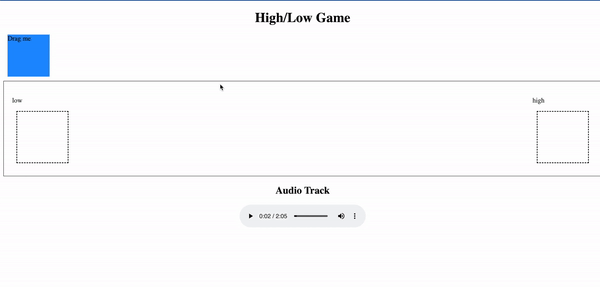

## First Iteration

Using Vanilla JS and HTML, I developed the first vision
of the drag and down high/low game.
Essentially, we want users to use their cursor to
drop the square onto the answer choice box, which
says either "High" or "Low".

The "High" and "Low" markers refer to the concept of identifying higher/lower frequencies.
Music teachers start teaching this concept to young (ages 3-6) students in a formal classroom.

In the next iteration, my goal is to have a game in which a music track plays and the user 
can identify the frequency. the tracks would automatically play from an external
API/DB collection of music, and the user would be able to keep track of points.

